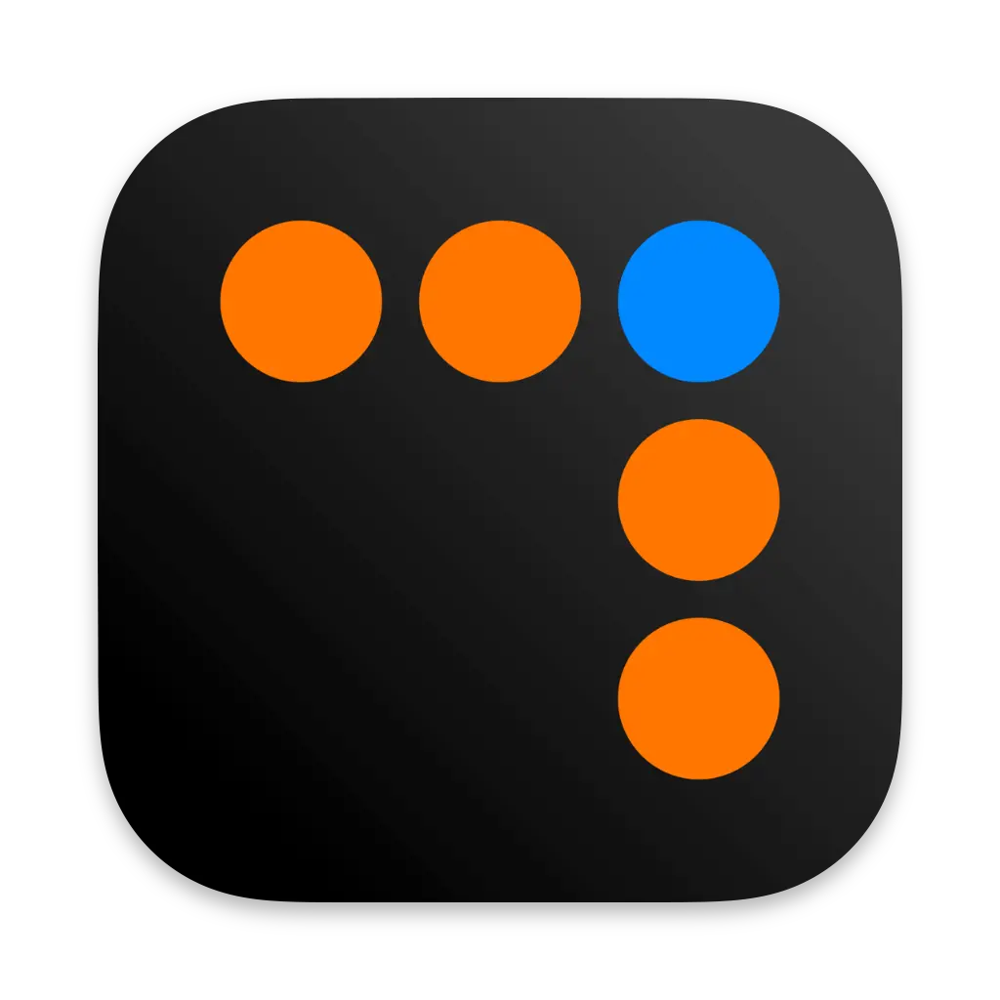
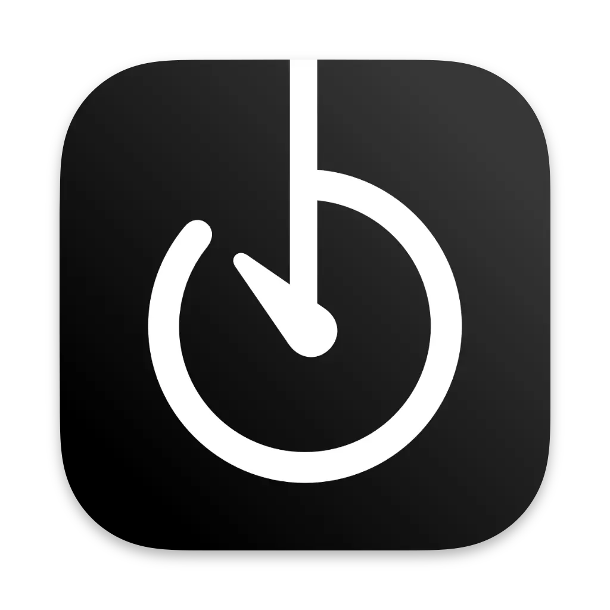
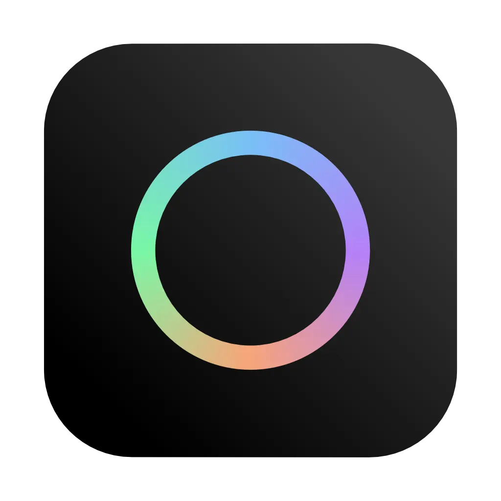
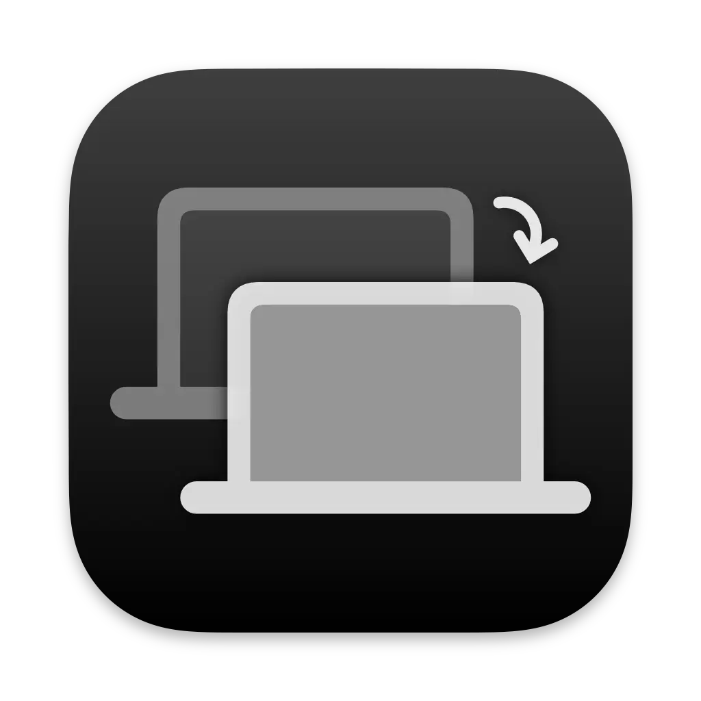

# Portfolio

### iOS / iPadOS 2025-12-06

| next.calc | re:timer | re:view (NEW) |
|-----------|----------|---------------|
|  |  |  |

### Mac only

| m.d.s. 2.0 (NEW) | x | x |
|------------------|---|---|
|  | x | x |

## BetterTouchTools Presets
- [Mouse Window Menu (MWM) - Window Management](https://community.folivora.ai/t/mouse-window-menu-mwm-window-management-via-floating-menu/33055)

## Alfred Workflows & Themes
- [git+ for Alfred: a fully customized git & zsh interface](https://github.com/jangelsb/git-plus-alfred-workflow)
- [Boop for Alfred](https://github.com/jangelsb/boop-for-alfred-workflow)
- [AutoTagger: Quickly Run URL Schemes](https://github.com/jangelsb/auto-tagger-alfred-workflow)
- [Spotlight-like Theme](https://www.alfredforum.com/topic/22462-spotlight-like-theme/)
- [Folder Navigation X](https://www.alfredforum.com/topic/22461-folder-navigation-x/)

## Newsletter
- [Follow my journey 👨‍💻](https://forms.gle/ZxvjMGiSwkbU3mtf8)
