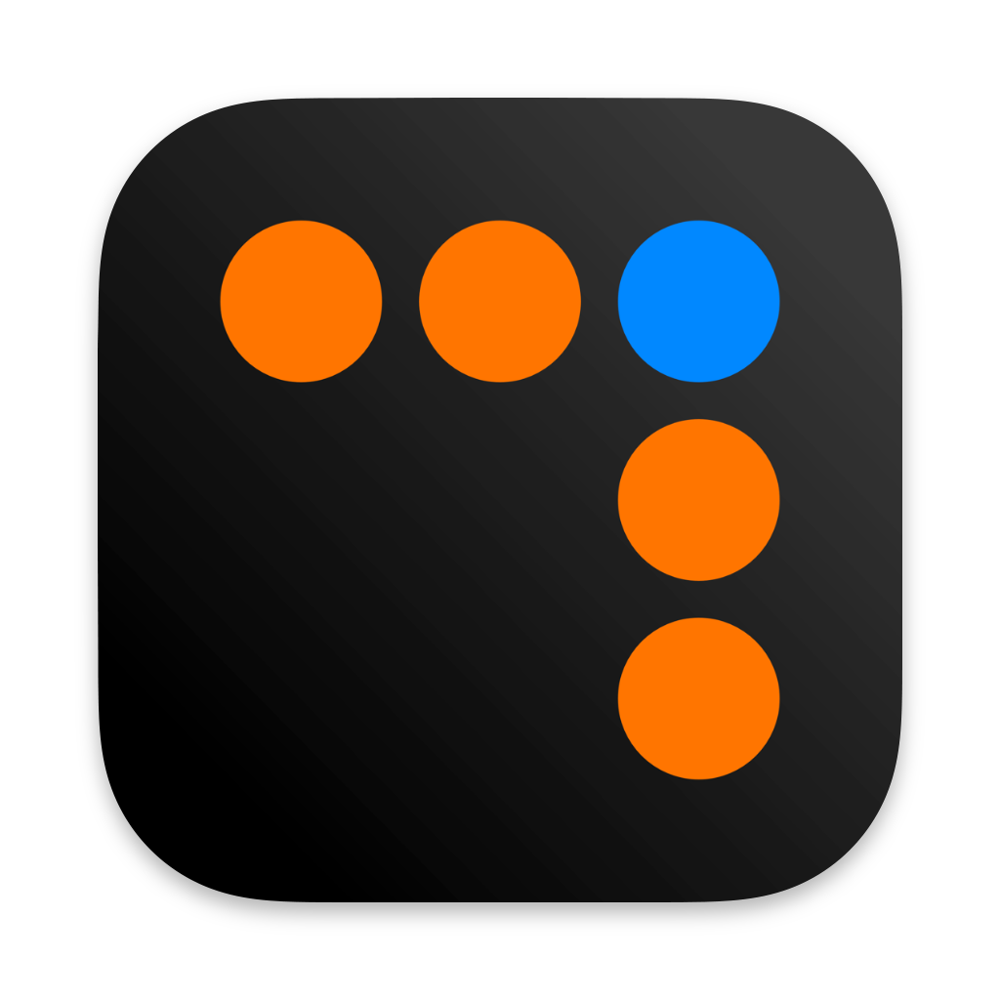

# Portfolio

| next.calc      | re:timer    | m.d.s.   |
| --------|---------|-------|-------|
|   |     |     |

## BetterTouchTools Presets
- [Mouse Window Menu (MWM) - Window Management](https://community.folivora.ai/t/mouse-window-menu-mwm-window-management-via-floating-menu/33055)
