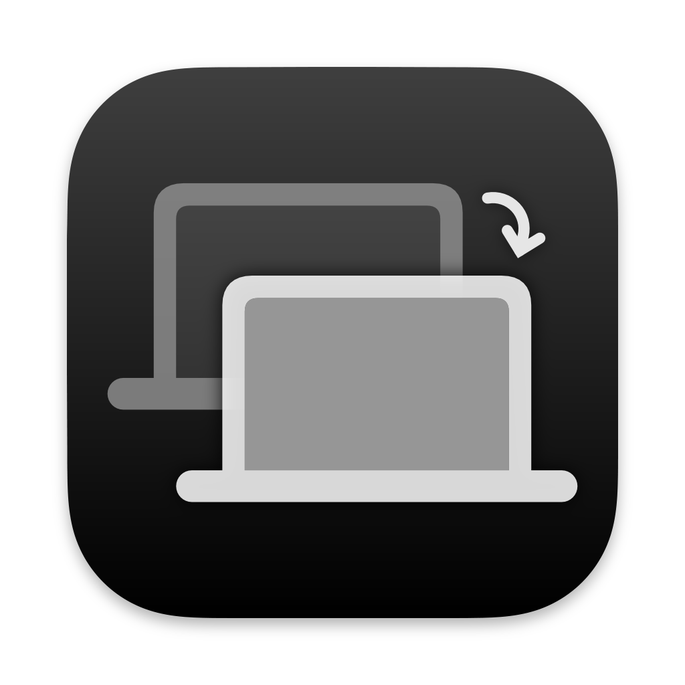

## My Apps

| next.calc      | re:timer (beta)    | Magic Device Switch (alpha)    |
| --------|---------|-------|-------|
|   |     |     |

## BetterTouchTools (BTT) Presets
- [Mouse Window Menu (MWM) - Window Management](https://community.folivora.ai/t/mouse-window-menu-mwm-window-management-via-floating-menu/33055)
