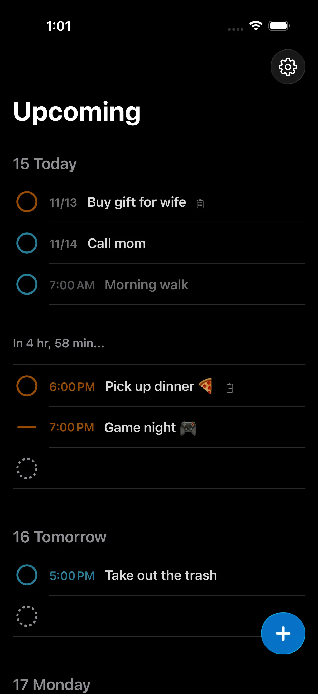
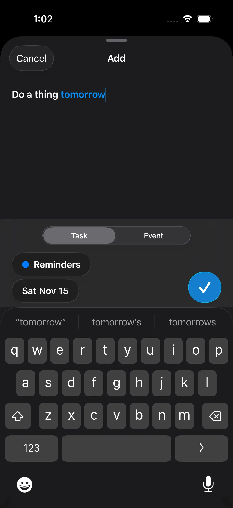
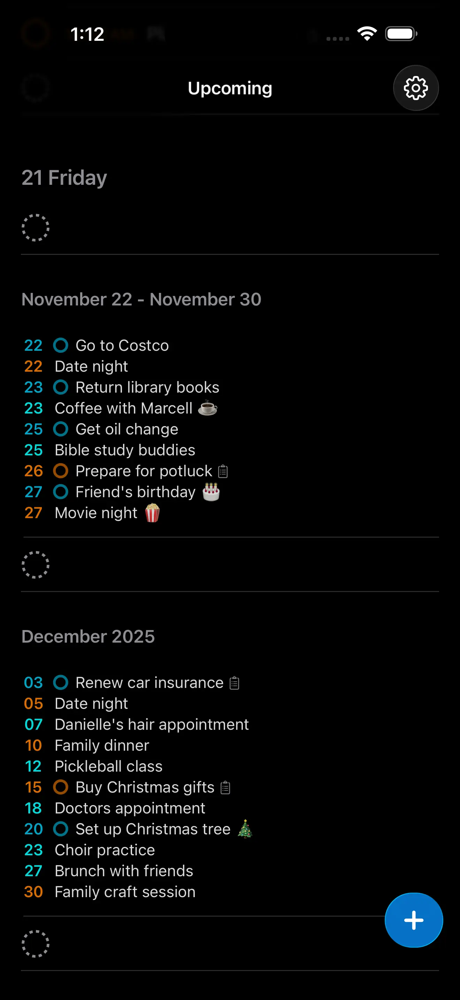

|      |     |     |     |
| --------|---------|-------|-------|
|     |    |     |     |

Inspired by Things3 and Sorted3 and Apple Reminders - comes a modern and elegant way to view your schedule, all powered by Apple Reminders and Calendars!

**Some features include**
* Supports a countdown to the next task or event
* Supports seeing events and tasks inline or separated 
* Supports natural language date input (English only)
* Keyboard shortcuts to add and save events
* Upcoming week breakdown
* Upcoming month breakdowns
* The ability create a reminder or event very quickly 
* The ability to open reminders in the Reminders app
* and more (with more coming!)

The goal of this app is not to replace your Calendar or Reminders app but to enhance it with quick creation and beautiful and digestible overviews of your schedule. Enjoy!

## Support
- [Privacy Policy](https://jangelsb.github.io/timer/privacy)
- <a href="mailto:nextcalc.feedback@gmail@@com?subject=re:timer Website"
   onmouseover="this.href=this.href.replace('@@','.')">
   Support Email
</a>