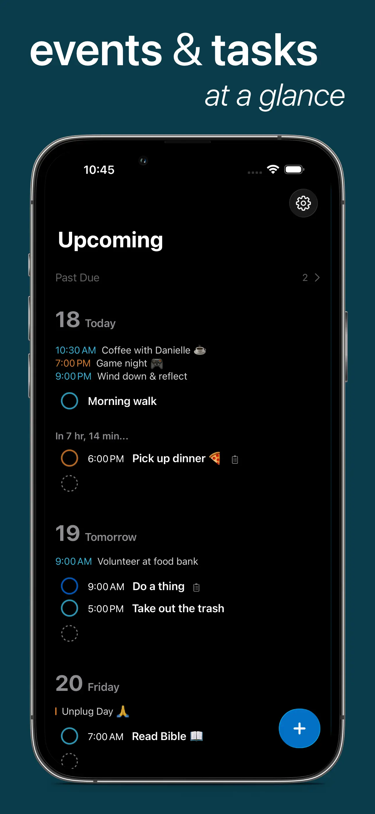
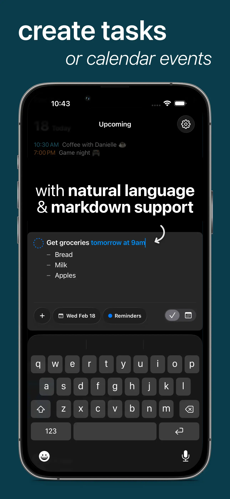
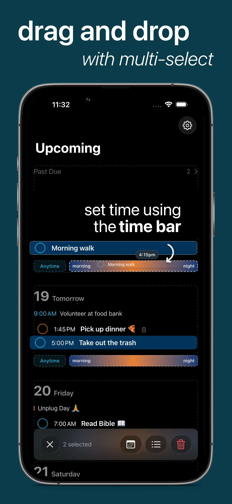
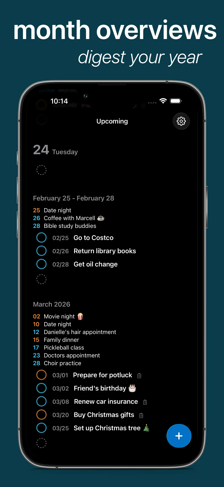

|      |     |     |     |
| --------|---------|-------|-------|
|     |    |     |     |

Inspired by Things3 and Sorted3 and Apple Reminders - comes a modern and elegant way to view your schedule, all powered by Apple Reminders and Calendars!

**Some features include**
* Beautiful card design
* Supports seeing events and tasks together (combined or separated)
* Supports a countdown to the next task or event
* The ability create a reminder or event really quickly 
* Supports natural language date input (English only - press enter with cursor touching blue date)
* Supports markdown
* Supports multi-select (swipe from right to left and down to quickly select items)
* Supports drag and drop
* Supports swiping left to right on past due items, events, and all items in the month overviews to reveal more information
* Full keyboard support (more info below)
* Upcoming week breakdown
* Upcoming month breakdowns
* The ability to open reminders in the Reminders app
* and more (with more coming!)

The goal of this app is not to replace your Calendar or Reminders app but to enhance it with quick creation and beautiful and digestible overviews of your schedule. Enjoy!

**Keyboard Shortcuts**
* ↑ / ↓ to navigate
* ← / → / ⏎ to collapse sections
* ⏎ to open items
* ⎋ to close without saving
* ⌘ + s / ⌘ + ⏎ to save
* ⌘ + d to change date
* ⌘ + l to change list
* ⌘ + k to complete / uncomplete
* [space] on focused item to select / unselect
* shift ↑ / ↓ to select the item above or below
* [delete] when selected or focused to delete
* ⌘ + n to create a new item

## Support
- [Privacy Policy](https://jangelsb.github.io/timer/privacy)
- <a href="mailto:nextcalc.feedback@gmail@@com?subject=re:view Website"
   onmouseover="this.href=this.href.replace('@@','.')">
   Support Email
</a>