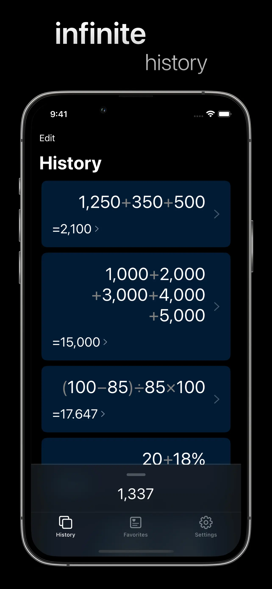

|      |     |     |
| --------|---------|-------|
|   |     |     |

|      |     |     |
| --------|---------|-------|
|     |    |     |

## Features include
- iOS designed inside and out
- One-handed keyboard
- A cursor -- allowing you to edit expressions easily
- Infix calculations -- uses order of operations (remember "Please excuse my dear Aunt Sally"?)
- Multi-lined expressions
- Syntax highlighting
- Real-time answers
- Infinite history
- Save expressions with context
- Keyboard and mouse support
- Intuitive cursor movement gesture (Swipe left and right on the keyboard)
- iPad keyboard gestures (Swipe down on keys with alternate values)
- iPad multitasking
- Copy, cut, and paste
- Beautiful animations
- Themes
- And more

## Accolades 
- "A pleasure to use" - Moms around the globe 

## Support
- [Privacy Policy](https://jangelsb.github.io/calc/privacy)
- [Feature Requests](https://github.com/jangelsb/next.calc-issues/issues?q=is%3Aopen+is%3Aissue+label%3Aenhancement+sort%3Areactions-%2B1-desc)
- [Known Bugs](https://github.com/jangelsb/next.calc-issues/issues?q=is%3Aopen+is%3Aissue+label%3Abug+sort%3Areactions-%2B1-desc)
- <a href="mailto:nextcalc.feedback@gmail@@com?subject=next.calc Website"
   onmouseover="this.href=this.href.replace('@@','.')">
   Support Email
</a>